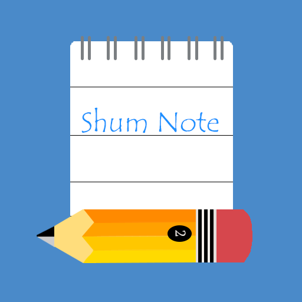
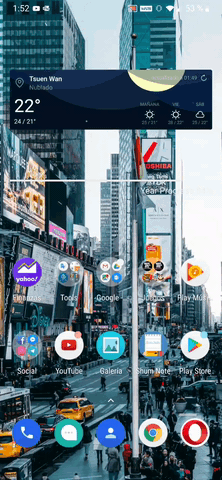
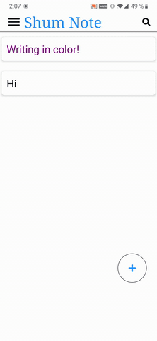
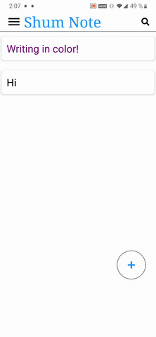
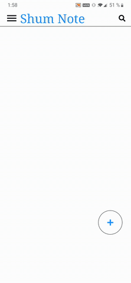
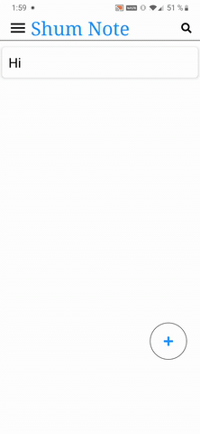
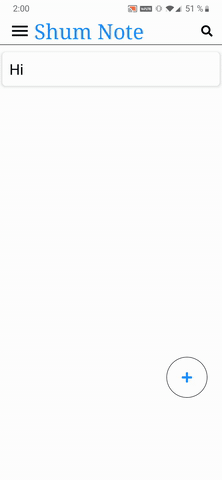
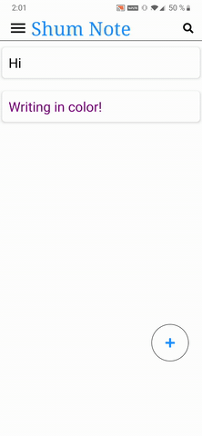
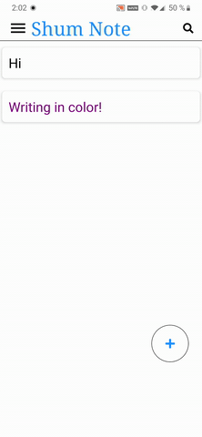
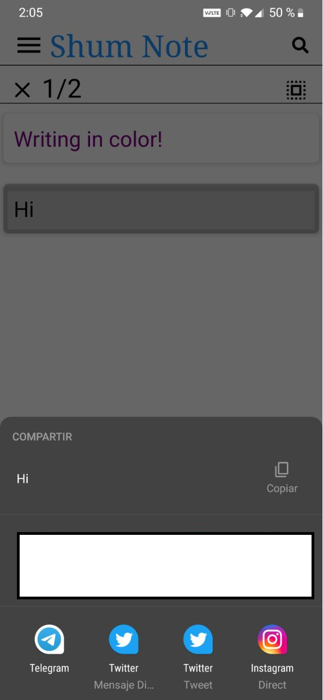

# SHUM NOTE :ledger:

A simple small notebloc made with react-native. For android devices only. 

<p align = "center"> </p>

# 

This is my third personal project, made this little app, it has the basic functions and a little of features with it, hope you like it :eyes: :raised_hands:

<p align = "center">  </p>

#

## BASIC FUNCTIONS:

### 

* Bullets List:

<p align = "center">  </p>

##

* Ordered List:

<p align = "center">  </p>
 
##

* Insert Images:

 <p align = "center">  </p>
 
##

### EXTRA FEATURES:

* Change your notes color :art::

 <p align = "center">  </p>
  
* Write in color :rainbow::
  
  <p align = "center">  </p>
  
* Dark mode :first_quarter_moon::

   <p align = "center">  </p>
 
* Archive your notes :paperclip::

 <p align = "center">  </p>
  
* Share your notes :envelope::
 
<p align = "center"> </p>
  
##
 
### ISSUES:
 
 * Auto scroll only avaible when it reaches a specific height. (
 This issues appears due the version of the ```RichTextEditor``` or due how it is programmed).
 * When scrolling text and images get highlighted. (
 This issues appears due the version of the ```RichTextEditor```).
 * In some devices when editing the note, sometimes the content and the style might not load correctly (I get this issue only from my Huawei P9 plus).
 
 This for now are the only issues that I have and I tried my best to fix them and give the best experience possible when using the app.
 
